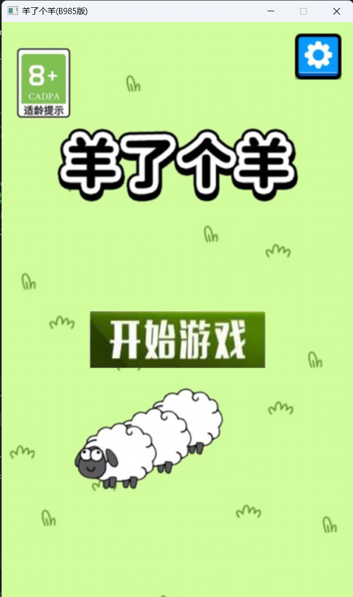
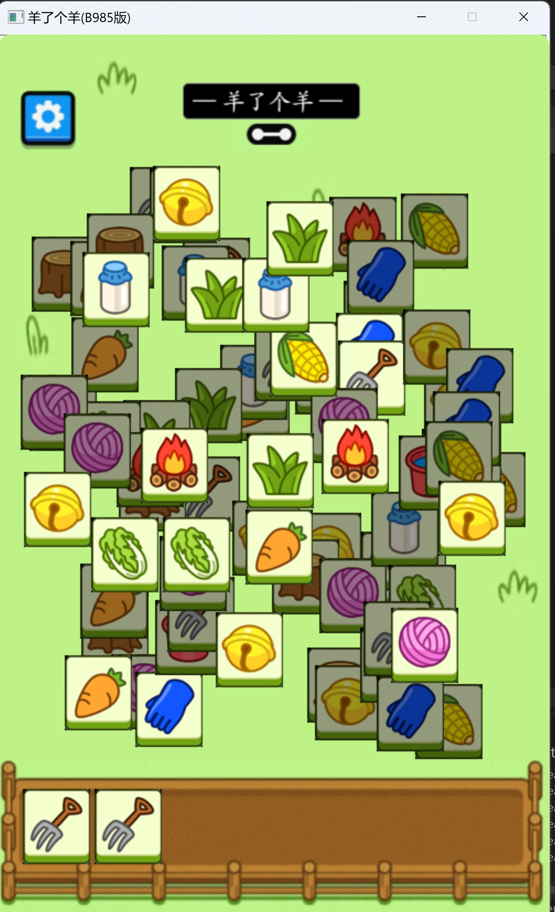
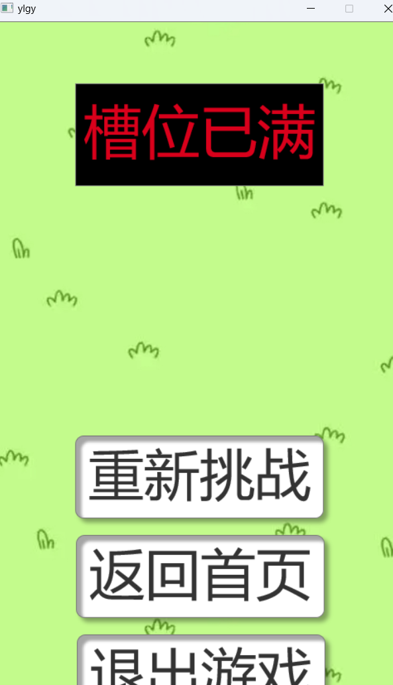

# 使用C++图形库EaxyX模仿的《羊了个羊》三消小游戏

V1.00
- 实现了三消功能
- 优化了开始界面、游戏界面、结束界面
- 优化了卡片的叠放逻辑
- 修复了游戏过程中点击卡片出现黑块的问题
- 修复了游戏过程中点击卡片游戏画面闪动问题

# 预览图

# 部署教程
请部署好easyX环境，使用 VS2022 IDE 打开ylgy.sln，运行即可。

此项目仅用于学习交流，如若侵权请联系QQ：1299254642